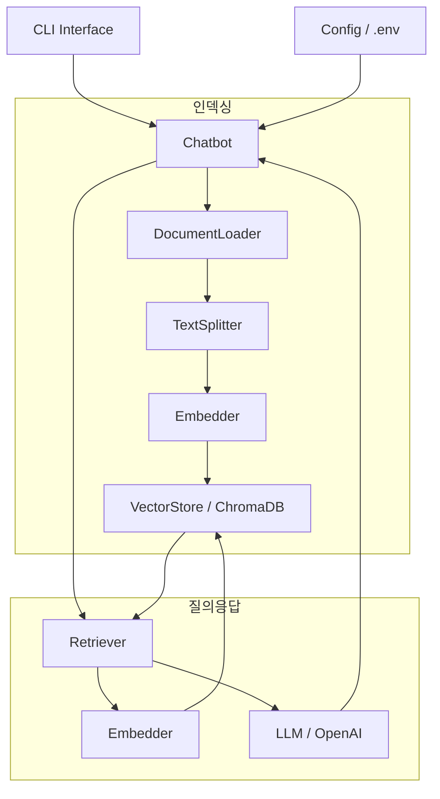

# 기술 설계 문서: RAG 챗봇

## 개요

Python 기반의 RAG(Retrieval-Augmented Generation) 챗봇 시스템입니다. 사용자가 로컬 문서(TXT, PDF, Markdown)를 업로드하면 벡터 DB에 인덱싱하고, 이후 사용자의 질문에 대해 관련 문서를 검색하여 LLM이 컨텍스트 기반 답변을 생성합니다. CLI 인터페이스를 통해 대화형으로 사용할 수 있으며, 환경 변수로 설정을 관리합니다.

### 기술 스택

- **언어**: Python 3.10+
- **LLM**: OpenAI GPT (API 호출)
- **임베딩**: OpenAI `text-embedding-ada-002` (기본값)
- **벡터 스토어**: ChromaDB (로컬 영속 저장)
- **문서 파싱**: `pypdf` (PDF), 표준 라이브러리 (TXT/MD)
- **설정 관리**: `python-dotenv`
- **테스트**: `pytest` + `hypothesis` (property-based testing)

---

## 아키텍처

시스템은 두 가지 주요 흐름으로 구성됩니다.

**인덱싱 파이프라인** (문서 등록 시):
```
파일 경로 → DocumentLoader → TextSplitter → Embedder → VectorStore
```

**질의응답 파이프라인** (사용자 질문 시):
```
사용자 질문 → Embedder → Retriever → LLM → 답변 출력
```

### 시스템 다이어그램



---

## 컴포넌트 및 인터페이스

### DocumentLoader

파일 경로를 받아 텍스트를 추출합니다.

```python
class DocumentLoader:
    def load(self, file_path: str) -> str:
        """
        지원 형식: .txt, .md, .pdf
        오류 시: FileNotFoundError, UnsupportedFormatError 발생
        """
```

### TextSplitter

긴 텍스트를 오버랩이 있는 청크로 분할합니다.

```python
class TextSplitter:
    def __init__(self, chunk_size: int = 500, chunk_overlap: int = 50): ...

    def split(self, text: str) -> list[str]:
        """텍스트를 chunk_size 단위로 분할, chunk_overlap만큼 겹침"""
```

### Embedder

텍스트(또는 텍스트 목록)를 벡터로 변환합니다.

```python
class Embedder:
    def embed(self, text: str) -> list[float]: ...
    def embed_batch(self, texts: list[str]) -> list[list[float]]: ...
```

### VectorStore

벡터와 원본 텍스트, 메타데이터를 저장하고 유사도 검색을 수행합니다.

```python
class VectorStore:
    def add(self, chunks: list[str], embeddings: list[list[float]], source: str) -> None: ...
    def search(self, query_embedding: list[float], top_k: int = 3) -> list[SearchResult]: ...
    def is_empty(self) -> bool: ...
```

### Retriever

질문을 받아 관련 청크를 검색합니다.

```python
class Retriever:
    def retrieve(self, query: str) -> list[SearchResult]:
        """
        VectorStore가 비어있으면 EmptyStoreError 발생
        """
```

### LLM

컨텍스트와 질문을 받아 답변을 생성합니다.

```python
class LLMClient:
    def generate(self, question: str, context: list[SearchResult]) -> str:
        """
        API 호출 실패 시 LLMError 발생
        """
```

### Chatbot

전체 파이프라인을 조율하는 메인 클래스입니다.

```python
class Chatbot:
    def ingest(self, file_path: str) -> None: ...
    def ask(self, question: str) -> str: ...
    def run_cli(self) -> None: ...
```

---

## 데이터 모델

### SearchResult

```python
@dataclass
class SearchResult:
    text: str           # 청크 원본 텍스트
    source: str         # 출처 파일명
    score: float        # 코사인 유사도 점수 (0.0 ~ 1.0)
```

### ConversationTurn

```python
@dataclass
class ConversationTurn:
    question: str
    answer: str
```

### Config

```python
@dataclass
class Config:
    openai_api_key: str          # 필수
    llm_model: str               # 기본값: "gpt-4o-mini"
    embedding_model: str         # 기본값: "text-embedding-ada-002"
    chunk_size: int              # 기본값: 500
    chunk_overlap: int           # 기본값: 50
    top_k: int                   # 기본값: 3
    vector_store_path: str       # 기본값: "./chroma_db"
```

### 환경 변수 매핑

| 환경 변수 | Config 필드 | 기본값 |
|---|---|---|
| `OPENAI_API_KEY` | `openai_api_key` | 없음 (필수) |
| `LLM_MODEL` | `llm_model` | `gpt-4o-mini` |
| `EMBEDDING_MODEL` | `embedding_model` | `text-embedding-ada-002` |
| `CHUNK_SIZE` | `chunk_size` | `500` |
| `CHUNK_OVERLAP` | `chunk_overlap` | `50` |
| `TOP_K` | `top_k` | `3` |
| `VECTOR_STORE_PATH` | `vector_store_path` | `./chroma_db` |

---

## 정확성 속성 (Correctness Properties)

*속성(Property)이란 시스템의 모든 유효한 실행에서 참이어야 하는 특성 또는 동작입니다. 즉, 시스템이 무엇을 해야 하는지에 대한 형식적 명세입니다. 속성은 사람이 읽을 수 있는 명세와 기계가 검증할 수 있는 정확성 보장 사이의 다리 역할을 합니다.*

### 속성 1: 청크 분할 크기 불변성

*임의의* 텍스트와 청크 크기 설정에 대해, TextSplitter가 생성한 모든 청크의 길이는 설정된 `chunk_size`를 초과하지 않아야 한다.

**검증 대상: 요구사항 1.4**

### 속성 2: 청크 오버랩 보존

*임의의* 텍스트에 대해, 연속된 두 청크는 `chunk_overlap` 크기만큼의 공통 텍스트를 포함해야 한다 (텍스트가 충분히 긴 경우).

**검증 대상: 요구사항 1.4**

### 속성 3: 인덱싱 후 검색 가능성 (Round Trip)

*임의의* 텍스트 청크를 VectorStore에 추가한 후, 해당 청크의 내용으로 검색하면 결과 목록에 해당 청크가 포함되어야 한다.

**검증 대상: 요구사항 1.6, 2.1**

### 속성 4: 빈 스토어 안내 메시지

*임의의* 질문에 대해, VectorStore가 비어있는 상태에서 Retriever를 호출하면 항상 검색 불가 안내를 반환해야 한다 (예외 또는 빈 결과가 아닌 명시적 안내).

**검증 대상: 요구사항 2.2**

### 속성 5: 검색 결과 출처 포함

*임의의* 검색 결과에 대해, 반환된 모든 SearchResult 객체는 비어있지 않은 `source` 필드를 포함해야 한다.

**검증 대상: 요구사항 2.3**

### 속성 6: 설정 기본값 적용

*임의의* 선택적 환경 변수 조합에 대해, 해당 변수가 설정되지 않은 경우 Config는 항상 사전 정의된 기본값을 사용해야 한다.

**검증 대상: 요구사항 5.3**

### 속성 7: 필수 설정 누락 시 명시적 오류

*임의의* 필수 환경 변수(`OPENAI_API_KEY`)가 누락된 경우, 시스템은 누락된 항목을 명시하는 오류 메시지를 출력하고 종료해야 한다.

**검증 대상: 요구사항 5.2**

---

## 오류 처리

### 커스텀 예외 계층

```python
class RagChatbotError(Exception): ...

class FileNotFoundError(RagChatbotError): ...
class UnsupportedFormatError(RagChatbotError): ...
class EmptyStoreError(RagChatbotError): ...
class LLMError(RagChatbotError): ...
class ConfigError(RagChatbotError): ...
```

### 오류 처리 전략

| 오류 상황 | 예외 | 사용자 메시지 |
|---|---|---|
| 파일 없음 | `FileNotFoundError` | "파일을 찾을 수 없습니다: {path}" |
| 지원하지 않는 형식 | `UnsupportedFormatError` | "지원하지 않는 파일 형식입니다: {ext}" |
| 빈 벡터 스토어 | `EmptyStoreError` | "검색 가능한 문서가 없습니다. 먼저 문서를 등록해주세요." |
| LLM 호출 실패 | `LLMError` | "오류가 발생했습니다. 잠시 후 다시 시도해주세요." |
| 필수 설정 누락 | `ConfigError` | "필수 설정이 누락되었습니다: {missing_keys}" |

LLM 오류의 경우 CLI에서 재시도 안내 메시지를 출력하고 입력 루프를 유지합니다.

---

## 테스트 전략

### 이중 테스트 접근법

단위 테스트와 속성 기반 테스트를 함께 사용합니다.

- **단위 테스트 (`pytest`)**: 구체적인 예시, 엣지 케이스, 오류 조건 검증
- **속성 기반 테스트 (`hypothesis`)**: 임의 입력에 대한 보편적 속성 검증 (최소 100회 반복)

### 단위 테스트 범위

- `DocumentLoader`: 각 파일 형식(TXT, PDF, MD) 로드, 파일 없음 오류, 지원하지 않는 형식 오류
- `TextSplitter`: 짧은 텍스트(청크 1개), 정확히 chunk_size인 텍스트, 오버랩 경계
- `Retriever`: 빈 스토어에서 호출 시 안내 메시지
- `Config`: 기본값 적용, 필수값 누락 시 오류
- `Chatbot`: `exit`/`quit` 입력 시 세션 종료

### 속성 기반 테스트 (`hypothesis`)

각 테스트는 설계 문서의 속성을 참조하는 태그를 포함합니다.

```python
# Feature: rag-chatbot, Property 1: 청크 분할 크기 불변성
@given(text=st.text(min_size=1), chunk_size=st.integers(min_value=50, max_value=1000))
def test_chunk_size_invariant(text, chunk_size): ...

# Feature: rag-chatbot, Property 2: 청크 오버랩 보존
@given(text=st.text(min_size=200))
def test_chunk_overlap_preserved(text): ...

# Feature: rag-chatbot, Property 3: 인덱싱 후 검색 가능성
@given(chunks=st.lists(st.text(min_size=10), min_size=1, max_size=10))
def test_ingest_then_retrieve_roundtrip(chunks): ...

# Feature: rag-chatbot, Property 4: 빈 스토어 안내 메시지
@given(query=st.text(min_size=1))
def test_empty_store_returns_guidance(query): ...

# Feature: rag-chatbot, Property 5: 검색 결과 출처 포함
@given(...)
def test_search_results_have_source(query): ...

# Feature: rag-chatbot, Property 6: 설정 기본값 적용
@given(env_vars=st.fixed_dictionaries({...}))
def test_config_defaults_applied(env_vars): ...

# Feature: rag-chatbot, Property 7: 필수 설정 누락 시 명시적 오류
@given(missing_key=st.sampled_from(["OPENAI_API_KEY"]))
def test_missing_required_config_raises_error(missing_key): ...
```

### 테스트 격리

- LLM 및 OpenAI API 호출은 `unittest.mock`으로 모킹
- VectorStore는 인메모리 ChromaDB 인스턴스 사용 (테스트용)
- 파일 시스템 접근은 `tmp_path` fixture 사용
